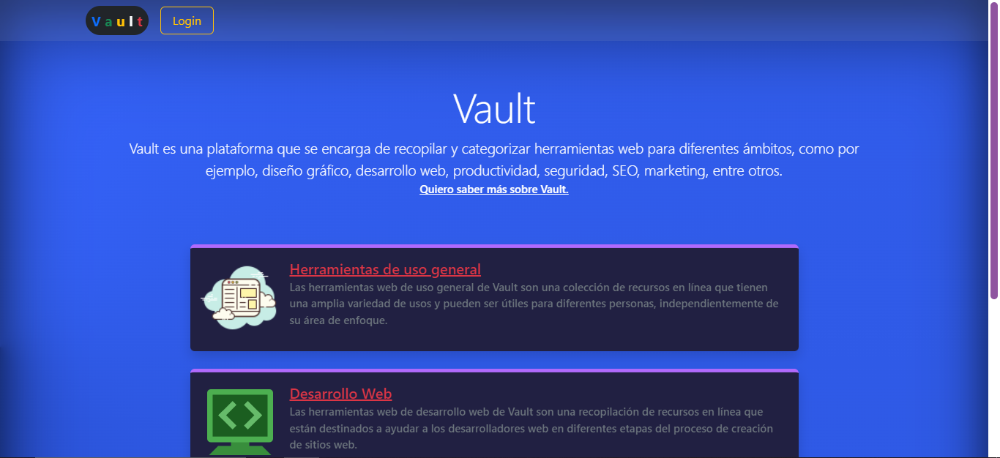
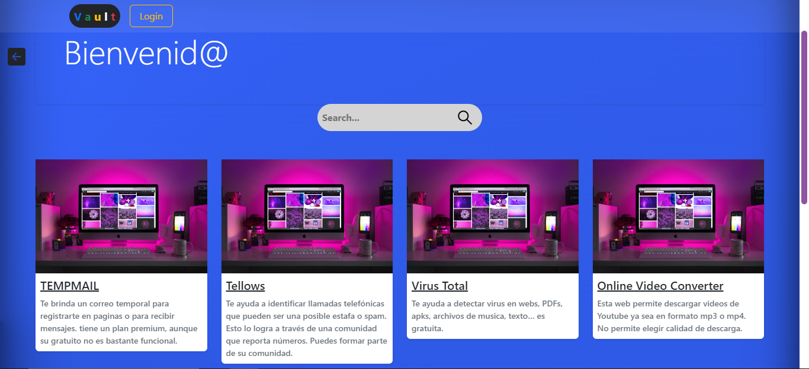
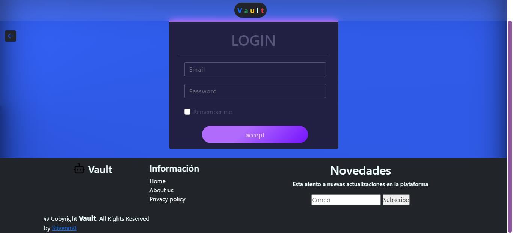
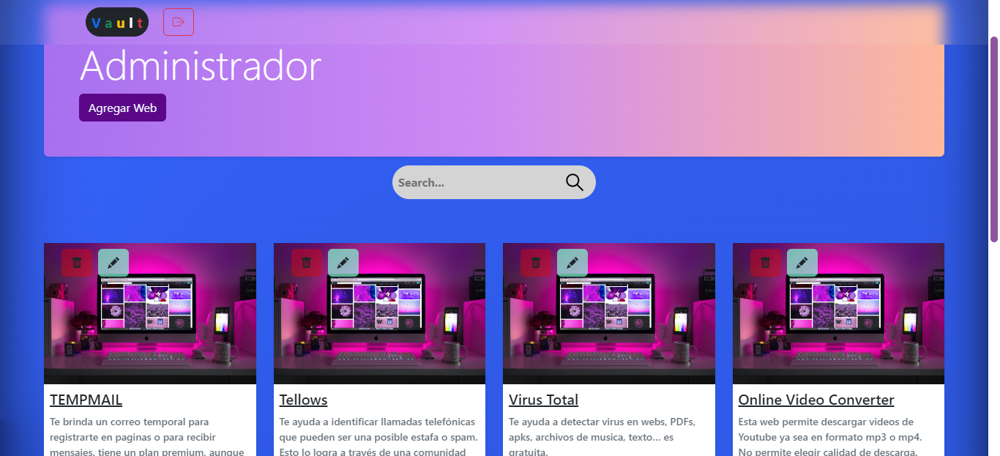

## Vault
El proyecto Vault es una recopilación de herramientas web y recursos útiles en línea, destinados a ayudar a los usuarios a encontrar las herramientas que necesitan para trabajar de manera más eficiente, aprender nuevas habilidades y divertirse. El proyecto tiene como objetivo proporcionar una solución centralizada para encontrar herramientas y recursos en línea, y es accesible para cualquier persona con una conexión a Internet.
### Screenshot

____________________________________________

___________________________________________

___________________________________________

## Technologies
***
A list of technologies used within the project:
* HTML
* SASS
* JavaScript
* json-sever

